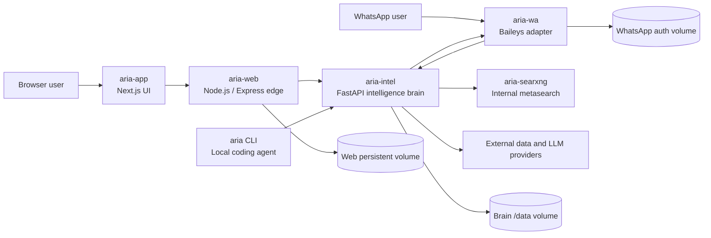
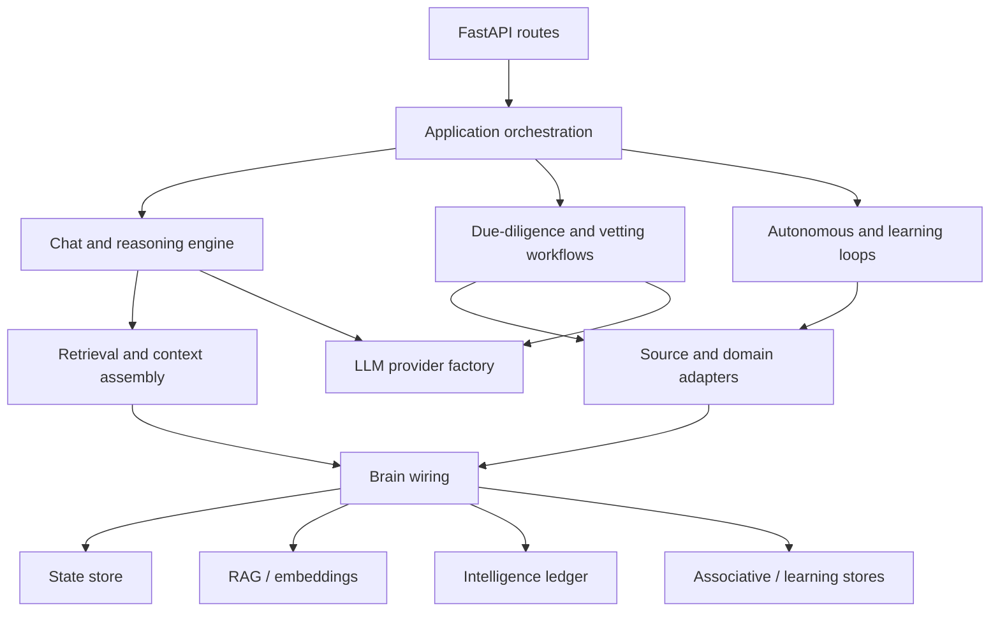
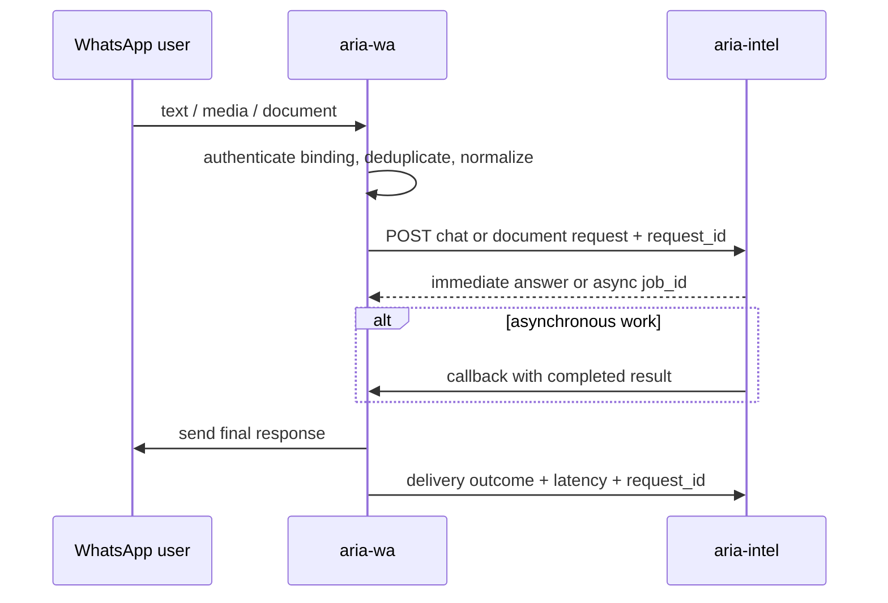
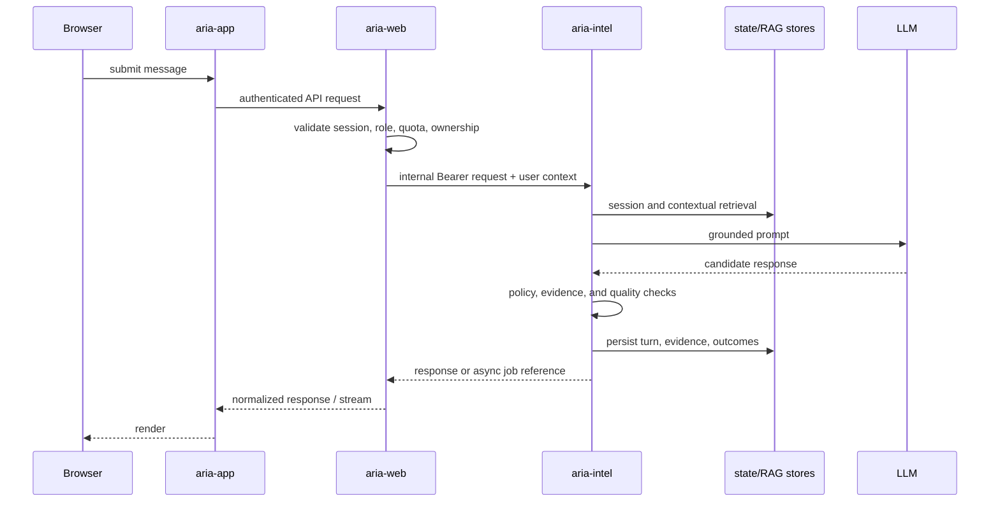
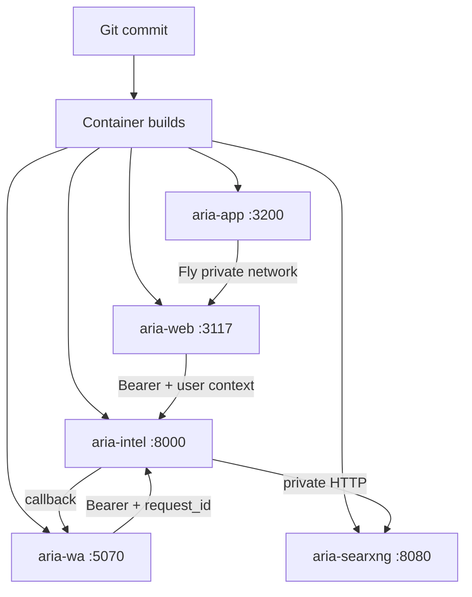

# ARIA Software Architecture

**Audience:** software engineers, architects, security engineers, DevOps/SRE, and technical partners  
**Architecture snapshot:** repository commit `dae009b2` on 2026-08-01  
**Change record:** R-F3623  
**Status vocabulary:** **Implemented** means evidenced by executable code or deployment configuration in this repository. **Configured** means a deploy/runtime configuration exists but this document does not claim the live service currently runs it. **Planned** means design material exists without a complete active runtime path.

## 1. Executive summary

ARIA is a multi-service intelligence platform. Its software is divided into a customer-facing web tier, an API and identity gateway, a stateful Python intelligence service, a WhatsApp adapter, an internal search service, and a local coding agent.

The principal design decision is that the Python service is the authoritative intelligence brain. User-facing services authenticate, normalize, and deliver requests, but durable intelligence state, retrieval, reasoning workflows, due-diligence orchestration, learning, and autonomous work live in `aria_service`.

The production-shaped topology is:



This is a modular-monolith architecture split across a small number of deployable processes—not a fine-grained microservice system. The Node and Python applications each contain many domain modules but deploy as single processes. That keeps cross-domain changes local while preserving hard isolation for channel adapters, search, and presentation.

## 2. System context and trust boundaries

### 2.1 Deployable components

| Component | Technology | Responsibility | Stateful | Primary source |
|---|---|---|---|---|
| `aria-app` | Next.js 14, React 18, TypeScript | Modern browser UI and server-side API forwarding | No | `aria-app/` |
| `aria-web` | Node.js 22, Express 5 | Authentication, authorization, legacy/static UI, public API, proxying, billing and channel administration | Yes | `server.mjs`, `lib/`, `public/` |
| `aria-intel` | Python, FastAPI, Uvicorn | Chat/reasoning, DD workflows, knowledge/RAG, autonomous loops, evidence and model orchestration | Yes | `aria_service/` |
| `aria-wa` | Node.js, Express, Baileys | WhatsApp connection lifecycle, inbound normalization, async dispatch, outbound delivery, delivery outcome reporting | Yes | `services/wa-listener/` |
| `aria-searxng` | SearXNG | Private metasearch backend used by the intelligence service | Operational state only | `searxng/` |
| `aria` CLI | Python | Local developer/coding agent backed by ARIA memory and LLM providers | Local state | `aria_cli/` |

Fly.io manifests configure the first five services in London (`lhr`). Local Node development can also run through `docker-compose.yml`.

### 2.2 Trust boundaries

1. **Public client boundary.** Browsers and public integrations terminate at `aria-app`, `aria-web`, or designated public FastAPI routes.
2. **Identity boundary.** `aria-web` owns user authentication, sessions, roles, quotas, and the browser-to-brain authorization bridge.
3. **Internal service boundary.** Web, WhatsApp, and intelligence services use shared internal credentials over Fly private networking or configured service URLs.
4. **Intelligence boundary.** `aria-intel` owns authoritative domain state and must independently validate authorization context; the edge is not a substitute for object-level checks.
5. **Provider boundary.** Search, LLM, email, messaging, and public-data providers are untrusted external systems. Their output requires provenance, validation, timeouts, and failure classification.
6. **Persistent-data boundary.** Fly volumes hold service-specific state. The brain volume is deliberately single-writer because Fly volumes are not shared filesystems.

## 3. Repository map

```text
crucix/
├── aria-app/                 Next.js application
├── aria_cli/                 local ARIA coding agent
├── aria_service/             Python intelligence service
│   ├── autonomous/           scheduled and self-directed work
│   ├── crawler/              crawling and document acquisition
│   ├── guardian/             policy and safety controls
│   ├── integrations/         external-system adapters
│   ├── intel/                intelligence, memory, DD, RAG, evidence
│   ├── learning/             learning and evaluation functions
│   ├── llm/                  model-provider abstraction
│   ├── metacognitive/        reflection and reasoning controls
│   ├── personas/             bounded behavioral configurations
│   ├── routes/               FastAPI routers
│   ├── search_engine/        Python search orchestration
│   ├── tests/                Python unit and capability tests
│   ├── vetting/              personnel/organization vetting domain
│   └── writers/              report/document generation
├── lib/                      Node domain modules
│   ├── llm/                  Node-side model adapters
│   ├── observability/        liveness and error tracking
│   ├── persist/              Node persistence adapters
│   ├── reports/              report routes, PDF generation, signing
│   ├── search/               Node search and entity lookup
│   ├── self/                 Node self-analysis/update features
│   ├── status/               health/status surfaces
│   ├── telegram/             Telegram publication tooling
│   └── whatsapp/             web-side WhatsApp management
├── services/wa-listener/     independently deployed WhatsApp service
├── searxng/                  internal search configuration and image
├── public/                   legacy/static web UI
├── middleware/               Express middleware
├── scripts/                  administration, deploy, audit, and test tools
├── test/                     Node unit/capability tests
├── docs/                     architecture, operations, assurance, ADR-like docs
├── data/                     versioned reference/evaluation data
├── server.mjs                Node web composition root
└── fly*.toml                 deployment manifests
```

## 4. Runtime architecture

### 4.1 Presentation layer: `aria-app`

`aria-app` is a stateless Next.js frontend. It renders customer, support, and administration experiences and forwards `/api` traffic to `aria-web`. It does not call `aria-intel` directly. This preserves one browser identity and policy enforcement point.

Key rules:

- Browser cookies terminate at the web tier.
- Server-side fetches use `BACKEND_URL`.
- The Fly image contains no persistent volume.
- `/healthz` is the service health surface.
- Migration is incremental: parts of the legacy static UI may still be served by `aria-web`.

### 4.2 Edge and application gateway: `aria-web`

`server.mjs` is the Node composition root. It configures Express middleware, authentication, rate controls, route handlers, static assets, channel integrations, and the proxy to the Python service.

Its main responsibilities are:

- registration, login, logout, password recovery, email verification, and 2FA;
- session and role enforcement (`requireAuth`, `requireAdmin`, and infrastructure-role checks);
- subscription/quota enforcement and public lead capture;
- browser-safe proxying to `/api/aria/*`;
- per-user ownership pinning where user identifiers cross the proxy boundary;
- static and legacy UI delivery;
- web-side reporting, search, Telegram, email, and administrative functions;
- cross-service health reporting and delivery-outcome feedback.

The gateway contains both explicit proxy routes and a final authenticated `/api/aria` catch-all. Explicit routes exist when they need stronger authorization, custom request transformation, streaming behavior, upload limits, or response handling.

### 4.3 Intelligence service: `aria-intel`

`aria_service/main.py` is the Python composition root. It creates the FastAPI application, initializes persistent stores and shared models, registers routers, starts singleton background loops, and exposes liveness/diagnostic surfaces.

The service is organized into these logical layers:



#### API layer

`aria_service/routes/aria.py` is the principal API router. Separate routers cover vetting and the externally shared vetting portal. A small set of root, health, client, webhook, and ingest routes remain in `main.py`.

API operations broadly group into:

- chat, streaming, asynchronous result retrieval, and session history;
- document ingestion, OCR, extraction, verification, and correction;
- DD orchestration, reports, watchlists, evidence vault, and entity graphs;
- sanctions, compliance, conflict, technology classification, investigation, and profiling;
- RAG search/ingest, knowledge, contradictions, and brain statistics;
- autonomy, diagnostics, calibration, evaluation, training data, and phase gates;
- user-scoped data, feedback, erasure, and administrative operations.

#### Chat and reasoning layer

`aria_service/aria_engine.py` owns the main conversational path. It:

1. classifies the request and selects a fast, document, or full reasoning lane;
2. loads the session and user-scoped context;
3. retrieves relevant knowledge, RAG results, neural associations, contradictions, and domain data;
4. constructs a bounded prompt with provenance and policy instructions;
5. calls a provider created by `aria_service/llm/factory.py`;
6. evaluates/guards the response and persists the turn;
7. updates learning signals only when supported by an honest correctness signal;
8. emits success or failure outcomes to the brain and delivery surfaces.

The synchronous and streaming handlers are separate entry paths. Any post-response safety, audit, capture, or learning hook must be deliberately applied to both.

#### Intelligence/domain layer

`aria_service/intel/` is the largest module group. It contains domain engines and infrastructure used by chat and non-chat workflows. Important architectural categories include:

- **Evidence and knowledge:** `knowledge.py`, `intel_ledger.py`, `evidence_status.py`, provenance and source-tier modules.
- **Retrieval:** `rag_store.py`, embedding support, re-ranking, source formatting, and rights/retention gates.
- **Persistence:** `state_store.py`, cold storage, migration, write queues, leases, and reconciliation.
- **Brain feedback:** `brain_hook.py` and `engine_wiring.py`.
- **Due diligence:** orchestration, layer implementations, report state, quarantine, vault, and watchlist modules.
- **Research and sources:** SearXNG, web research, registries, sanctions, procurement, news, and specialist feeds.
- **Quality controls:** contradiction detection, calibration, groundedness, hallucination checks, adversarial evaluation, and phase-gate measurement.
- **Operations:** circuit breakers, liveness, scheduler state, delivery outcomes, diagnostics, and cost tracking.

### 4.4 WhatsApp adapter: `aria-wa`

The WhatsApp service is a channel adapter, not a second brain. It owns connection state and message delivery while delegating intelligence work to `aria-intel`.

Inbound flow:



The callback and delivery-outcome stages are essential: generation success does not imply the user received a message. The service persists WhatsApp credentials on its own volume and exposes authenticated management routes for accounts, QR codes, bindings, governance, sending, and callbacks.

### 4.5 Search service: `aria-searxng`

SearXNG is an internal-only metasearch dependency. `aria-intel` reaches it through the Fly private network. Search orchestration can combine it with direct public-data adapters and other permitted fallbacks; SearXNG itself is not a system of record.

### 4.6 Local coding agent: `aria_cli`

The `aria` CLI is a separate local developer tool. Its architecture mirrors a compact coding agent:

- `agent.py`: turn/tool orchestration;
- `coder_tools.py` and `tools.py`: filesystem, shell, memory, and developer operations;
- `llm.py`: provider interaction;
- `brain.py` and `bridge.py`: ARIA brain integration;
- `memory.py`: persistent lessons, facts, patterns, and failures;
- `safety.py` and `redact.py`: command and secret protections;
- `supervisor.py`: process resilience;
- `prompt.py`: system/project instruction assembly.

It is distributed as the `aria` console script by `pyproject.toml`. It shares the project and may call brain services, but it is not in the browser request path.

## 5. Core request flows

### 5.1 Browser chat



### 5.2 Document processing

1. The edge applies route-specific upload and body-size controls.
2. The brain records an extraction job and invokes the relevant PDF, Office, image, or OCR path.
3. Extracted text is sanitized and segmented.
4. Facts/findings retain source and extraction provenance.
5. Approved content is ingested into retrieval and knowledge stores.
6. Verification/correction endpoints preserve review state instead of silently replacing provenance.
7. Large or slow operations use job IDs and result endpoints.

### 5.3 Due-diligence orchestration

DD is implemented as an orchestrated workflow rather than one model prompt. A run coordinates identity resolution, corporate/ownership data, sanctions and PEP screening, adverse information, commercial and jurisdictional checks, evidence verification, synthesis, and report generation.

Architectural properties:

- each layer produces structured output and provenance;
- layer failures are explicit and feed a completeness/confidence view;
- the final report is stored by run/case ID and exposed through report/vault APIs;
- watchlists can re-run checks and generate alerts;
- quarantined or incomplete runs retain investigation state;
- report rendering is downstream of structured evidence, not the primary data model.

The exact active layer set should be read from the current orchestrator and tests before changing the workflow; older architecture documents contain historical layer counts.

### 5.4 Autonomous work

Long-running loops are started from the FastAPI lifespan and use singleton/lease semantics so tasks are not duplicated when process topology changes. Categories include research, source health, self-diagnostics, learning/student work, watchlist monitoring, and maintenance.

Rules for adding a loop:

- identify whether it is one-shot or recurring;
- acquire the appropriate singleton/leader lease;
- avoid blocking the FastAPI event loop with CPU or synchronous I/O;
- emit heartbeat/liveness evidence;
- wire both completion and failure to the brain;
- make writes idempotent and safe across restart;
- provide a bounded shutdown path;
- add a capability test that drives the real loop body.

## 6. Data architecture

### 6.1 State store

`aria_service/intel/state_store.py` provides a Redis-like asynchronous API over SQLite-backed durable storage. Consumers use key/value, JSON, list, hash, sorted-set, counter, expiration, lease, and scan operations without owning database connections.

The implementation includes:

- a bounded asynchronous write queue and dedicated writer worker;
- separate read connections;
- WAL checkpointing and connection recovery;
- hot/cold database routing and cold-store backfill;
- strict read/write variants for code that must distinguish absence from store failure;
- TTL support while protecting designated infinite-retention keys;
- liveness probes, watchdogs, forensic dumps, and queue/store diagnostics.

This abstraction is a critical dependency. Domain modules should not open the state databases directly.

### 6.2 Retrieval-augmented generation store

`aria_service/intel/rag_store.py` owns persistent vector retrieval. It provides:

- document chunking and deterministic IDs;
- text sanitization and content-hash deduplication;
- shared sentence-transformer embeddings;
- asynchronous ingest and batch paths;
- semantic search with credibility and recency inputs;
- optional hybrid re-ranking;
- formatted context with source metadata;
- collection diagnostics and corruption quarantine;
- retention, rights, subject-erasure, and purge operations;
- hot-to-cold offload behavior.

The model is baked into the intelligence image and configured for offline loading. The RAG path resolves under `/data` in production so it survives machine replacement.

### 6.3 Brain wiring and feedback

`brain_hook.absorb()` is the shared ingestion/feedback gateway. Domain features call higher-level `wire_success()` and `wire_failure()` helpers so outcomes become observable and learnable.

The gateway coordinates:

- intelligence signal recording;
- knowledge and RAG ingestion;
- neural/associative updates;
- learning and mastery observations;
- per-module health statistics;
- backpressure, concurrency gates, and circuit breaking;
- queued/background absorption;
- user and sector context propagation.

Not every payload belongs in every substrate. The gateway makes that routing decision centrally and protects interactive latency during background ingestion.

### 6.4 Service-owned data

| Owner | Examples | Storage model |
|---|---|---|
| `aria-intel` | sessions, cases, evidence, knowledge, RAG, ledgers, autonomous state, delivery outcomes | SQLite/Chroma/files under `/data` |
| `aria-web` | users, web sessions, plans/quotas, web application state | files/adapters under its persistent directory |
| `aria-wa` | device credentials, account/binding state, channel queues | files under its `/data` volume |
| `aria-app` | presentation state only | stateless deployment; browser/session data comes from web APIs |

Cross-service duplication should be treated as a projection or cache with an explicit owner. Do not create a second authoritative copy by convenience.

## 7. LLM and model architecture

Python model creation is centralized in `aria_service/llm/factory.py`. Callers request a provider through the factory rather than directly importing a vendor SDK. This isolates provider selection, credentials, model defaults, telemetry, fallbacks, and future self-hosted models.

The model layer is designed around:

- provider-neutral completion/chat contracts;
- runtime configuration through environment variables;
- bounded timeouts and classified provider failures;
- cost and latency metering;
- retrieval-before-generation for knowledge tasks;
- fallback transparency;
- response verification before success is reported;
- local or self-hosted model activation without changing domain callers.

Node also has adapters under `lib/llm/` for Node-owned features. New intelligence reasoning should normally live in Python so evidence, RAG, policy, and learning paths remain consistent.

## 8. Security architecture

### 8.1 Identity and authorization

`aria-web` is the main user identity provider. It implements password authentication, session/token lifecycle, optional 2FA, email verification, roles, force logout, and audit/admin routes.

Authorization is layered:

- public routes are explicitly registered;
- user routes require authenticated sessions;
- privileged mutations require admin or infrastructure roles;
- internal service calls use a separate Bearer credential;
- user-scoped identifiers are pinned or checked at the edge and brain;
- destructive/erasure operations have dedicated guarded endpoints.

### 8.2 Input and output controls

- Express defines route-specific JSON, form, and upload size limits.
- Document text is sanitized before retrieval ingestion.
- URLs and external content are treated as untrusted.
- Terminal and tool outputs in the CLI pass through redaction.
- Reports preserve evidence/provenance and distinguish measured, unknown, and failed states.
- Messaging delivery success is reported only after the channel send completes.

### 8.3 Secrets

Secrets are supplied through runtime environment/Fly secrets and must not enter the repository, browser bundles, logs, or architecture diagrams. Internal URLs are not secrets; service tokens and provider credentials are.

### 8.4 Data lifecycle

The system combines long-lived intelligence memory with subject erasure, retention classification, and rights controls. Engineers adding a new store must define:

- authoritative owner;
- retention class and legal basis;
- subject lookup/erasure mechanism;
- backup and recovery behavior;
- provenance and correction semantics;
- whether the data may enter model context or training exports.

## 9. Reliability and observability

### 9.1 Health model

Each deployable process has a shallow liveness endpoint suitable for platform probes. Rich health and diagnostic endpoints expose dependencies, background work, queues, source health, build revision, and cross-service status.

The distinction is intentional:

- **liveness:** can the process accept traffic without expensive dependency work;
- **readiness/health:** are important dependencies and subsystems functioning;
- **diagnostic:** why a subsystem is slow, stale, open-circuit, or failing;
- **outcome/proprioception:** did a user-visible action actually complete and deliver.

### 9.2 Failure containment

The architecture uses:

- circuit breakers for failing providers and overloaded brain ingestion;
- bounded queues for persistence and background absorption;
- explicit asynchronous jobs for long operations;
- singleton leases for background loops;
- deduplication and idempotency keys on messaging and ingestion paths;
- strict store reads where “missing” and “failed to read” have different meanings;
- dead-letter/quarantine state for work requiring investigation;
- delivery callbacks and request IDs across service boundaries.

### 9.3 Known structural constraints

These are design constraints visible in the repository, not claims about current live health:

- `aria-intel` uses a single attached Fly volume, which constrains horizontal scaling and requires explicit leader/single-writer design.
- Both `server.mjs` and `aria_service/main.py` are large composition roots; route/domain extraction must preserve middleware order and lifespan behavior.
- Background intelligence work shares resources with interactive requests, so every new loop must be load- and latency-aware.
- Browser traffic crosses two presentation/gateway hops (`aria-app` then `aria-web`) during the frontend migration.
- The streaming and non-streaming chat paths can drift unless parity is tested.
- External-source quality and availability vary; “no result” is not proof that an entity or event does not exist.

## 10. Deployment architecture



Deployment properties:

- services are independently containerized and deployed;
- build revision is injected and exposed by health endpoints;
- production state is mounted under `/data` for the stateful services;
- `aria-intel` bakes the embedding model and runs Hugging Face transformers offline;
- deploy scripts enforce source push, build revision, health checks, and live verification;
- the Next.js service is stateless and can be replaced independently;
- private `*.internal` service names keep internal traffic off the public Internet.

The repository deployment entry points are `scripts/deploy.ps1` on Windows and `scripts/deploy.sh` on Linux/macOS. Engineers should not infer a successful deployment from a successful image build; the live `build_rev` must match the intended commit.

## 11. Development and test architecture

### 11.1 Local development

- Python: use the repository virtual environment and run `python -m aria_service.main` or targeted tests.
- Node web: `npm start` or `npm run dev`.
- Next.js: run scripts from `aria-app/package.json` on port 3200.
- Local composition: `docker-compose.yml` starts the Node application and maps its persistent run directory.
- Service URLs and credentials are environment-driven; do not hardcode production endpoints in domain modules.

### 11.2 Test layers

| Layer | Purpose | Location |
|---|---|---|
| Python unit tests | function/module contracts | `aria_service/tests/` |
| Python capability tests | real user-visible or cross-module paths | `aria_service/tests/` |
| CLI tests | agent tools, safety, memory, provider behavior | `aria_cli/tests/` |
| Node unit/capability tests | web routes, proxying, security, reports | `test/` |
| WhatsApp tests | listener, callback, delivery, watchdog behavior | `services/wa-listener/test_*.mjs` |
| Build/compile gates | syntax, import, TypeScript/build integrity | scripts and package commands |
| Live smoke tests | deployed health/build revision and endpoint behavior | deployment scripts/probes |

For changes to `main.py` or startup dependencies, importing modules is insufficient: run the lifespan path because most infrastructure is initialized there.

## 12. Extension guide

### Add a new FastAPI capability

1. Place domain logic in the relevant package, not in `main.py` or the route handler.
2. Verify all called functions and sync/async signatures.
3. Define typed request/response models.
4. Add success and failure brain wiring before implementing the happy path.
5. Use the state-store abstraction and provider factory.
6. Preserve provenance and user ownership.
7. Register the route in the correct router.
8. Add an explicit edge proxy route only if special authorization or transformation is required; otherwise validate the catch-all behavior.
9. Add unit and capability tests, including empty, malformed, provider-failure, and store-failure paths.

### Add a data source

1. Implement a narrow adapter with a normalized result contract.
2. Record source identity, retrieval time, jurisdiction, rights, and credibility tier.
3. Distinguish no-match, unavailable, rate-limited, parse-failed, and unauthorized.
4. Wire successful and failed runs.
5. Ingest only validated content into knowledge/RAG.
6. Add fixtures for normal, empty, malformed, and changed upstream responses.
7. Register health and freshness reporting.

### Add a user-facing channel

1. Keep transport/device state in a separate adapter service.
2. Normalize inbound messages to the brain contract with user identity and request ID.
3. Support asynchronous completion for slow work.
4. Deduplicate retries and callbacks.
5. Report actual delivery outcome to the brain.
6. Expose health, account/binding state, and failure diagnostics.

### Add a model provider

1. Implement the provider interface under `aria_service/llm/`.
2. Register it in `factory.py`; domain modules must not import it directly.
3. Normalize timeout, authentication, quota, safety, and malformed-response failures.
4. Add metering and provider identity to traces.
5. Test selection, success, failure, and fallback behavior through the factory.

## 13. Architectural invariants

Developers should preserve these invariants:

1. The Python brain is authoritative for intelligence state.
2. The web tier is authoritative for browser identity and coarse role/quota enforcement.
3. Object ownership is still checked at the authoritative service.
4. Channel adapters never become independent reasoning brains.
5. All user-visible actions report both success and failure; delivery is separate from generation.
6. Domain code uses shared persistence, RAG, model, evidence, and wiring abstractions.
7. Facts and reports retain provenance; absence is not evidence of a negative finding.
8. Unknown/unmeasurable state is not converted into success.
9. Background work is idempotent, lease-aware, restart-safe, and non-blocking.
10. No store is added without ownership, retention, erasure, backup, and recovery rules.
11. Streaming and non-streaming paths maintain behavioral parity.
12. A deployment is complete only when the live build revision is verified.

## 14. Source-of-truth index

Use this order when documentation and implementation differ:

1. Executable code and tests at the current commit.
2. Deployment manifests and Dockerfiles.
3. Current operational configuration and live probes.
4. This document.
5. Historical architecture, roadmap, and assessment documents.

Primary files for architectural review:

- `server.mjs` — web composition root, auth, routes, and brain proxy.
- `aria_service/main.py` — intelligence composition root and lifespan.
- `aria_service/routes/aria.py` — principal intelligence API.
- `aria_service/aria_engine.py` — conversational orchestration.
- `aria_service/intel/brain_hook.py` — brain absorption and health gateway.
- `aria_service/intel/state_store.py` — durable state abstraction.
- `aria_service/intel/rag_store.py` — vector retrieval and lifecycle controls.
- `aria_service/llm/factory.py` — model provider creation.
- `services/wa-listener/aria_wa_listener.mjs` — WhatsApp transport and delivery loop.
- `aria-app/next.config.mjs` and `aria-app/lib/api.ts` — frontend/backend boundary.
- `fly.toml`, `fly.web.toml`, `services/wa-listener/fly.toml`, `aria-app/fly.app.toml`, and `searxng/fly.toml` — deployed topology.
- `Dockerfile.web` and `aria_service/Dockerfile` — production runtime contents.

## 15. What this document deliberately does not claim

- It does not report live health, live data volumes, current model selection, route counts, or test-pass counts without a same-session live probe.
- It does not treat roadmap features as implemented.
- It does not expose credentials, internal tokens, customer data, or operational secrets.
- It does not replace API schemas, threat models, deployment runbooks, or domain-specific DD methodology documents.
